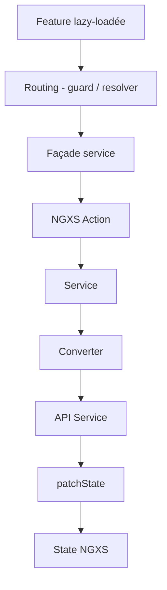
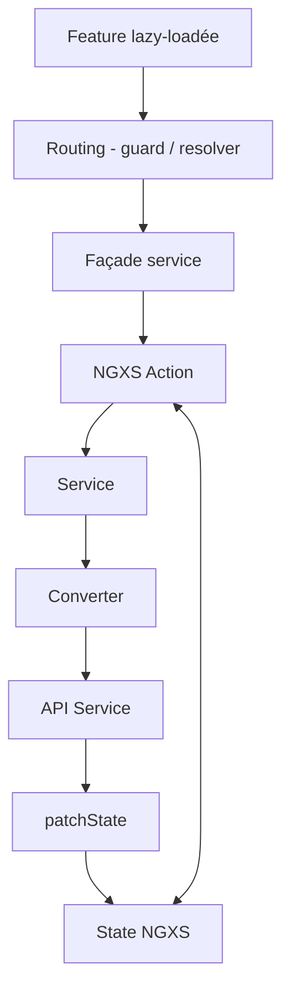
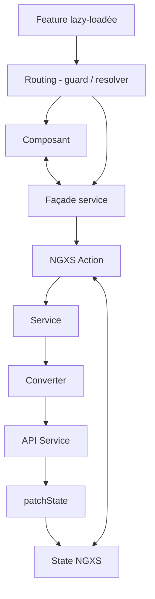
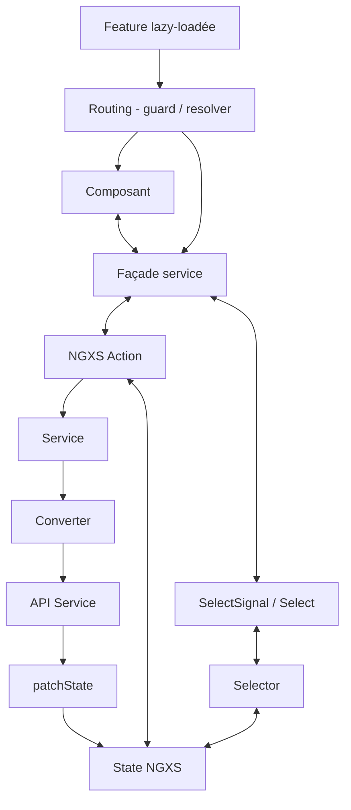
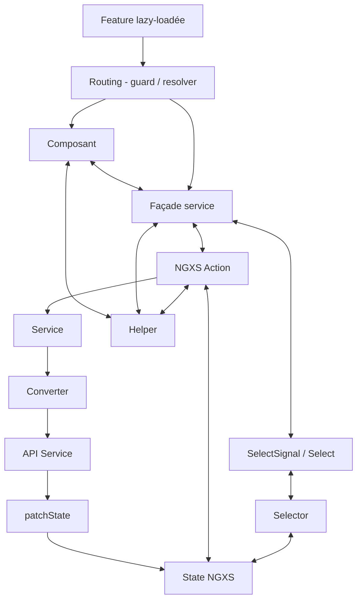
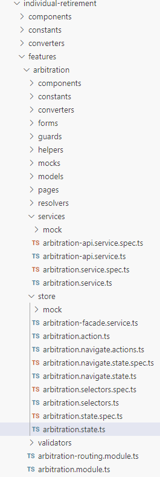

# Exemple d'architecture

  

```mermaid {theme: 'neutral', scale: 0.45}
 graph TD
  A[Feature lazy-loadée]
  A --> B[Routing - guard / resolver]
  B --> C[Façade service]
  C --> D[NGXS Action]
  D --> E[Service]
  E --> F[Converter]
  F --> G[API Service]
  G --> H[patchState]
  H --> I[State NGXS]

```

  

  

```mermaid {theme: 'neutral', scale: 0.45}
 graph TD
  A[Feature lazy-loadée]
  A --> B[Routing - guard / resolver]
  B --> C[Façade service]
  C --> D[NGXS Action]
  D --> E[Service]
  E --> F[Converter]
  F --> G[API Service]
  G --> H[patchState]
  H --> I[State NGXS]

  D <--> I

```
 

   

```mermaid {theme: 'neutral', scale: 0.45}
 graph TD
  A[Feature lazy-loadée]
  A --> B[Routing - guard / resolver]
  B --> C[Composant]
  C <--> D[Façade service]
  D --> E[NGXS Action]
  E --> F[Service]
  F --> G[Converter]
  G --> H[API Service]
  H --> I[patchState]
  I --> J[State NGXS]

  B --> D

  E <--> J

```
 

  

```mermaid {theme: 'neutral', scale: 0.45}
 graph TD
  A[Feature lazy-loadée]
  A --> B[Routing - guard / resolver]
  B --> C[Composant]
  C <--> D[Façade service]
  D <--> E[NGXS Action]
  E --> F[Service]
  F --> G[Converter]
  G --> H[API Service]
  H --> I[patchState]
  I --> J[State NGXS]

  D <--> K[SelectSignal / Select] 
  K <--> L[Selector] 

  E <--> J

  B --> D

  L <--> J

``` 
 

   

```mermaid {theme: 'neutral', scale: 0.45}
 graph TD
  A[Feature lazy-loadée]
  A --> B[Routing - guard / resolver]
  B --> C[Composant]
  C <--> D[Façade service]
  D <--> E[NGXS Action]
  E --> F[Service]
  F --> G[Converter]
  G --> H[API Service]
  H --> I[patchState]
  I --> J[State NGXS]

  D <--> K[SelectSignal / Select] 
  K <--> L[Selector] 

  E <--> J

  B --> D

  L <--> J

  C <--> M[Helper]
  D <--> M
  E <--> M

``` 
 

::right::

  

- helper
