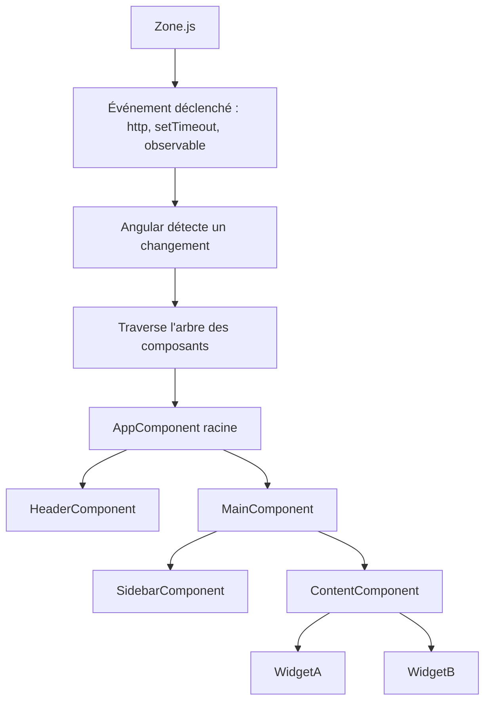
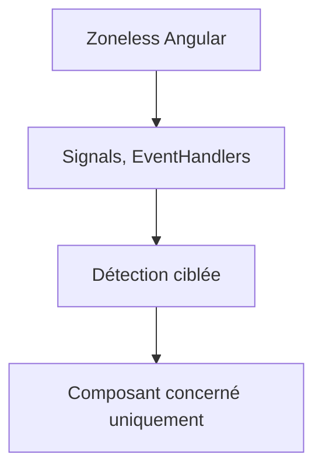

# Contrôle de flux (@if, @for, @switch)

<div grid="~ cols-2 gap-4">
<div>

###### @if

````md magic-move {lines: true}
```ts {*|1,4}
<div *ngIf="user; else noUser">
  Bonjour {{ user.name }} !
</div>
<ng-template #noUser>
  <p>Utilisateur inconnu</p>
</ng-template>
```

```ts {1,5|*}
@if (user) {
  <div>
    Bonjour {{ user.name }} !
  </div>
} @else {
  <p>Utilisateur inconnu</p>
}
```
````

</div>

<div>

###### @for

````md magic-move {lines: true}
```html {*|2}
<ul>
  <li *ngFor="let item of items">{{ item }}</li>
</ul>
```

```html {2|*}
<ul>
  @for (item of items; track item) {
    <li>{{ item }}</li>
  }
</ul>
```
````

</div>
</div>

<br>

###### @switch

````md magic-move {lines: true}
```html {*|1}
<div [ngSwitch]="status">
  <p *ngSwitchCase="'loading'">Chargement...</p>
  <p *ngSwitchCase="'success'">Succès ✅</p>
  <p *ngSwitchDefault>Erreur ❌</p>
</div>
```

```ts {1,2|*}
@switch (status) {
  @case ('loading') {
    <p>Chargement...</p>
  }
  @case ('success') {
    <p>Succès ✅</p>
  }
  @default {
    <p>Erreur ❌</p>
  }
}
```
````

<!-- Le mot-clé **track** dans la directive @for (introduite dans Angular 17) sert à optimiser le rendu de la boucle en identifiant de manière unique chaque élément. C’est équivalent à trackBy dans *ngFor.

Une gestion plus fine du DOM
Une meilleure compatibilité avec Zone-less
Moins de recalculs DOM grâce à track
=> En gros : plus de perfs, surtout sur de grandes listes dynamiques.

Détection de type améliorée
Grâce à la syntaxe structurée, Angular peut :
Mieux détecter les erreurs de type
Offrir plus d’auto-complétion dans les IDE
 -->

---
layout: image-left
image: https://cover.sli.dev
---

# Composant standalone et lazy-loadé

```ts {2|*}
@Component({
  standalone: true,
  selector: "app-user-card",
  imports: [CommonModule],
  templateUrl: "./user-card.component.html",
})
export class UserCardComponent {
  user$ = this.userService.getUser();
}
```

<br>

```html {1,3,5,7|*}
@defer (when product$ | async) {
<product-view [product]="product" />
} @placeholder {
<div class="loader">Chargement du produit...</div>
} @loading {
<app-loading-spinner />
} @error {
<p class="text-red-500">Erreur de chargement 😢</p>
}
```

---
---

# Zone.js pour une application réactive
<style>
  p {
    color: orange;
    border: 1px solid orange;
    text-align: center;
    padding: 10px
  }

</style>
<div grid="~ cols-2 gap-4">
<div>

- Librairie JavaScript qui **patch** les API async (setTimeout, Promises, XHR…)
- Angular (depuis V2) s’appuie dessus pour **savoir automatiquement quand lancer la détection des changements**

<div v-click="1" v-motion
  :initial="{ x: -50 }"
  :enter="{ x: 0 }"
>
<br>
<br>
  <p>Trop magique et trop gourmand</p>
</div>

</div>

<div>


</div>
</div>

---
---

# Zoneless pour une meilleure application réactive
<div grid="~ cols-2 gap-4">
<div>

- Dépendance externe progressivement retiré d'Angular.
- Angular au travers des signals, sait exactement quel composant mettre à jour.

</div>

<div>


</div>


</div>

<div v-click="1" v-motion
  :initial="{ x: -50 }"
  :enter="{ x: 0 }"
>

<div grid="~ cols-2 gap-4">

<div>
```ts {*}
Typescript
providers: [
    provideZoneChangeDetection('noop') //in main.ts
  ]

changeDetection: ChangeDetectionStrategy.OnPush

const count = signal(0);
const double = computed(() => count() * 2);

effect(() => {
  console.log("Double:", double());
});

count.set(1);
```
</div>

<div>
```html {*}
Template html
<div>
    <p>{{count()}}</p>
</div>
```
</div>

</div>

</div>
---
---

# Signal props binding

- Intègre les capacités des signals (computed, effect, etc)

<br>

### Input()
<div grid="~ cols-2 gap-4">

<div>
````md magic-move {lines: true}
```ts {*|1}
@Input()
protected name: string:
```

```ts {*}
protected name = input.required<string>();
```
````
</div>


<div>
````md magic-move {lines: true}
```html {1|0}
<mon-composant-enfant [name]='Grégory'></mon-composant-enfant>
```

```html {1}
<mon-composant-enfant [name]='Grégory'></mon-composant-enfant>
```
````
</div>


</div>

<br>
<br>

### Output()
<div grid="~ cols-2 gap-4">

<div>
````md magic-move {lines: true}
```ts {*|1,2}
@Output()
protected setName = new EventEmitter<string>():

this.setName.emit('Grérory')
```

```ts {*}
protected name = output.<string>();

this.setName.emit('Grérory')
```
````
</div>


<div>
````md magic-move {lines: true}
```html {1|0}
<mon-composant-enfant (setName)='setName($event)'></mon-composant-enfant>
```

```html {1}
<mon-composant-enfant (setName)='setName($event)'></mon-composant-enfant>
```
````
</div>


</div>
---
---

# Signal vs Observable


---
---
=> Signal vs observable (unsubscribe)  
=> pipe observable
